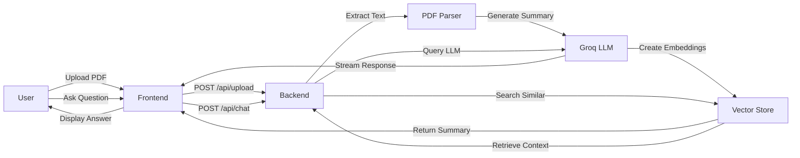

# Research Assistant 🔬

An AI-powered research paper analysis platform that combines PDF summarization, intelligent Q&A chat, and voice interaction capabilities. Built with a React frontend and FastAPI backend, leveraging RAG (Retrieval-Augmented Generation) for context-aware responses.

[](https://www.python.org/downloads/)
[](https://reactjs.org/)
[](https://fastapi.tiangolo.com/)
[](LICENSE)

## 🎯 What is Research Assistant?

Research Assistant is a comprehensive tool designed to help researchers, students, and academics quickly understand and interact with research papers. Upload a PDF, get an AI-generated structured summary, and ask questions about the content using natural language or voice input.

### ✨ Key Capabilities

- **📄 Smart PDF Analysis**: Extract structured information from research papers
- **💬 Interactive Q&A**: Ask questions and get context-aware answers using RAG
- **🎤 Voice Interface**: Use speech-to-text for hands-free interaction
- **🎨 Modern UI**: Clean, responsive interface with dark/light themes
- **⚡ Real-time Streaming**: Get instant AI responses via Server-Sent Events
- **🔍 Semantic Search**: FAISS-powered vector database for accurate retrieval

---

## 🏗️ Project Architecture

```
Research Assistant/
├── 📁 Backend/              # FastAPI server (Python)
│   ├── controllers/         # Business logic
│   ├── routes/             # API endpoints
│   ├── services/           # Core services (PDF, vector store, speech)
│   ├── schemas/            # Data models
│   ├── Dockerfile          # Backend container
│   └── .env               # Backend environment variables
│
├── 📁 Frontend/             # React application (JavaScript)
│   ├── src/
│   │   ├── components/    # Reusable UI components
│   │   ├── pages/         # Route pages
│   │   ├── api/           # Backend integration
│   │   └── context/       # State management
│   ├── public/            # Static assets
│   ├── Dockerfile         # Frontend container
│   └── .env              # Frontend environment variables
│
├── docker-compose.yml      # Docker orchestration
├── .env                   # Root environment variables (for Docker Compose)
└── README.md              # This file
```

---

## 🛠️ Technology Stack

### Backend (FastAPI + AI)

| Technology | Purpose | Version |
|------------|---------|---------|
| **FastAPI** | Web framework | 0.124.0 |
| **LangChain** | LLM orchestration | 1.1.2 |
| **Groq** | LLM provider (openai/gpt-oss-120b) | 1.1.0 |
| **FAISS** | Vector database | 1.13.1 |
| **Faster-Whisper** | Speech-to-text | 1.2.1 |
| **PyMuPDF** | PDF processing | 1.26.6 |

**Core Features:**
- PDF text extraction and structured summarization
- RAG-based question answering with conversation history
- Real-time streaming responses via Server-Sent Events
- Audio transcription with multiple format support (wav, mp3, webm, ogg)
- Vector store management for semantic search

**API Endpoints:**
- `POST /api/upload` - PDF upload and summarization
- `POST /api/chat` - Streaming chat Q&A
- `POST /api/transcribe` - Audio to text conversion

### Frontend (React + Vite)

| Technology | Purpose | Version |
|------------|---------|---------|
| **React** | UI framework | 18.3.1 |
| **Vite** | Build tool | 6.0 |
| **Tailwind CSS** | Styling | 3.4.17 |
| **Axios** | HTTP client | 1.7.9 |
| **PDF.js** | PDF viewer | 3.11.174 |
| **React Markdown** | Markdown rendering | 9.0.1 |

**Core Features:**
- Drag-and-drop PDF upload interface
- Interactive PDF viewer with zoom and navigation
- Real-time streaming chat with markdown support
- Voice recording and transcription
- Light/dark theme with system preference detection
- Responsive design for all devices

**User Flow:**
```
Upload PDF → View Summary → Read PDF → Ask Questions → Get AI Responses
```

---

## 🚀 Quick Start Guide

### Prerequisites

- **Backend**: Python 3.11+, Groq API key
- **Frontend**: Node.js 18+, npm/yarn
- **Docker** (Optional): Docker and Docker Compose
- **System**: Windows/Linux/Mac

### 🐳 Option 1: Docker Compose (Recommended)

**⚡ Easiest way to run both services together**

#### 1️⃣ Setup Environment Variables

Create a `.env` file in the **root directory** (same level as `docker-compose.yml`):

```env
# Root .env file for Docker Compose
GROQ_API_KEY=your_groq_api_key_here
```

**Get Groq API Key:**
1. Visit [console.groq.com](https://console.groq.com)
2. Sign up/Login
3. Navigate to API Keys section
4. Create new API key
5. Copy and paste into `.env` file

#### 2️⃣ Run with Docker Compose

```bash
# From root directory
docker-compose up

# Or run in detached mode (background)
docker-compose up -d

# View logs
docker-compose logs -f

# Stop services
docker-compose down
```

**✅ Services will be available at:**
- 🚀 **Backend API**: `http://localhost:8000`
- 🎨 **Frontend App**: `http://localhost:5173`
- 📖 **API Docs**: `http://localhost:8000/docs`

#### 3️⃣ Useful Docker Commands

```bash
# Run only backend
docker-compose up backend

# Run only frontend
docker-compose up frontend

# Rebuild and run
docker-compose up --build

# Stop and remove containers
docker-compose down

# View logs for specific service
docker-compose logs -f backend
docker-compose logs -f frontend

# Restart services
docker-compose restart
```

---

### 💻 Option 2: Manual Setup

#### 1️⃣ Setup Backend

```bash
# Navigate to backend directory
cd Backend

# Create virtual environment
python -m venv .venv

# Activate virtual environment
# Windows:
.venv\Scripts\activate
# Linux/Mac:
source .venv/bin/activate

# Install dependencies
pip install -r requirements.txt

# Create .env file in Backend directory
echo GROQ_API_KEY=your_groq_api_key_here > .env

# Run server
uvicorn main:app --reload --host 0.0.0.0 --port 8000
```

✅ Backend will run at: `http://localhost:8000`

#### 2️⃣ Setup Frontend

Open a **new terminal** and run:

```bash
# Navigate to frontend directory
cd Frontend

# Install dependencies
npm install
# or
yarn install

# Create .env file in Frontend directory
echo VITE_API_URL=http://localhost:8000/api > .env

# Run development server
npm run dev
# or
yarn dev
```

✅ Frontend will run at: `http://localhost:5173`

---

### 🐋 Option 3: Individual Docker Containers

```bash
# Backend
cd Backend
docker build -t research-assistant-backend .
docker run -p 8000:8000 --env-file .env research-assistant-backend

# Frontend (in new terminal)
cd Frontend
docker build -t research-assistant-frontend .
docker run -p 5173:5173 research-assistant-frontend
```

---

## 📋 Environment Configuration

### 📍 Root Environment (.env) - For Docker Compose

Create `.env` file in the **root directory**:

```env
# Groq API Key (Required)
GROQ_API_KEY=your_groq_api_key_here
```

**⚠️ Important Notes:**
- This `.env` file is used by `docker-compose.yml`
- Must be in the **root directory** (same level as `docker-compose.yml`)
- Required **only** when using Docker Compose

### 📍 Backend Environment (Backend/.env) - For Manual Setup

Create `.env` file in the **Backend directory**:

```env
GROQ_API_KEY=your_groq_api_key_here
```

### 📍 Frontend Environment (Frontend/.env) - For Manual Setup

Create `.env` file in the **Frontend directory**:

```env
VITE_API_URL=http://localhost:8000/api
```

### 📊 Environment Files Summary

```
Research Assistant/
├── .env                 # ✅ Root level (for Docker Compose only)
│   └── GROQ_API_KEY=xxx
│
├── Backend/
│   └── .env            # ✅ Backend level (for manual setup)
│       └── GROQ_API_KEY=xxx
│
└── Frontend/
    └── .env            # ✅ Frontend level (for manual setup)
        └── VITE_API_URL=http://localhost:8000/api
```

**❓ Which .env file do I need?**

| Setup Method | Required Files |
|--------------|----------------|
| **Docker Compose** | Root `.env` only |
| **Manual Setup** | `Backend/.env` + `Frontend/.env` |
| **Individual Docker Containers** | `Backend/.env` + `Frontend/.env` |

### 📝 Environment Variables Reference

| Variable | Location | Purpose | Required | Example |
|----------|----------|---------|----------|---------|
| `GROQ_API_KEY` | Root `.env` | API key for Groq LLM (Docker Compose) | Yes | `gsk_xxx...` |
| `GROQ_API_KEY` | `Backend/.env` | API key for Groq LLM (Manual setup) | Yes | `gsk_xxx...` |
| `VITE_API_URL` | `Frontend/.env` | Backend API URL | Yes | `http://localhost:8000/api` |

---

## 🎮 How to Use

### 1️⃣ Upload a Research Paper
- Open `http://localhost:5173` in your browser
- Drag and drop a PDF file or click to browse
- Wait for AI to process and extract information
- **Maximum file size**: 20MB

### 2️⃣ View Structured Summary
Automatically generated sections:
- **📑 Title & Authors**: Paper identification
- **📝 Abstract**: Research overview
- **❓ Problem Statement**: Core research question
- **🔬 Methodology**: Research approach and techniques
- **📊 Key Results**: Main findings and data
- **✅ Conclusion**: Summary and implications

Click sections to expand/collapse for better readability.

### 3️⃣ Read the Paper
- Use the PDF viewer on the right panel
- Zoom in/out with controls
- Navigate pages with arrows
- Search within document

### 4️⃣ Ask Questions
- Type questions in the chat input
- **OR** click the 🎤 microphone icon to use voice input
- Press **Enter** or click **Send**
- Watch AI generate real-time streaming responses
- Responses include markdown formatting and citations

### 5️⃣ Continue Conversation
- Ask follow-up questions
- Context is maintained throughout session
- Previous messages are visible in chat history
- AI remembers the entire conversation

---

## 📁 Detailed Project Structure

### Backend Structure

```
Backend/
├── 📂 controllers/          # Business logic layer
│   ├── chatController.py        # Handles chat requests with RAG
│   └── summarizeController.py   # Processes PDFs and generates summaries
│
├── 📂 routes/              # API endpoint definitions
│   ├── chatRoutes.py            # Chat endpoints
│   ├── summaryRoutes.py         # PDF upload endpoints
│   └── speechRoutes.py          # Audio transcription endpoints
│
├── 📂 services/            # Core functionality
│   ├── helpers.py               # PDF text extraction utilities
│   └── vectorStore.py           # FAISS vector store management
│
├── 📂 schemas/             # Data validation models
│   └── schema.py                # Pydantic models for requests/responses
│
├── 📄 main.py              # FastAPI application entry point
├── 📄 requirements.txt     # Python dependencies
├── 🐳 Dockerfile           # Docker configuration
├── 🔐 .env                 # Environment variables (not committed)
└── 📖 README.md            # Backend documentation
```

### Frontend Structure

```
Frontend/
├── 📂 src/
│   ├── 📂 components/      # Reusable UI components
│   │   ├── Header.jsx            # Top navigation with theme toggle
│   │   ├── PDFViewer.jsx         # PDF display component
│   │   ├── SummaryPanel.jsx      # Summary display container
│   │   ├── SummaryAccordion.jsx  # Collapsible summary sections
│   │   ├── ChatPanel.jsx         # Chat interface container
│   │   ├── ChatMessage.jsx       # Individual message bubble
│   │   ├── ChatInput.jsx         # Input with voice recording
│   │   └── LoadingOverlay.jsx    # Loading state indicator
│   │
│   ├── 📂 pages/           # Route pages
│   │   ├── UploadPage.jsx        # PDF upload landing page
│   │   └── HomePage.jsx          # Main application interface
│   │
│   ├── 📂 api/             # Backend integration
│   │   └── index.js              # API client and endpoints
│   │
│   ├── 📂 context/         # Global state
│   │   └── ThemeContext.jsx      # Theme management (light/dark)
│   │
│   ├── 📂 hooks/           # Custom React hooks
│   │   └── useTheme.js           # Theme hook
│   │
│   ├── 📄 App.jsx          # Root component with routing
│   └── 📄 main.jsx         # Application entry point
│
├── 📂 public/              # Static files
├── 📄 index.html           # HTML template
├── ⚙️ vite.config.js       # Vite configuration
├── 🐳 Dockerfile           # Docker configuration
├── 🔐 .env                 # Environment variables (not committed)
└── 📖 README.md            # Frontend documentation
```

---

## 🔄 Data Flow



1. **PDF Upload Flow**: 
   - Frontend → Backend `/api/upload` → PDF Processing → Summary Generation → Vector Store Creation → Summary Display

2. **Chat Interaction Flow**: 
   - Frontend → Backend `/api/chat` → Vector Search (FAISS) → LLM Query (Groq) → Streaming Response (SSE) → Frontend Display

3. **Voice Input Flow**: 
   - Frontend (Audio Recording) → Backend `/api/transcribe` → Speech Recognition (Whisper) → Text → Frontend Input

---

## 🔧 Configuration & Customization

### Backend Configuration

**File**: `Backend/main.py`

```python
# CORS settings (adjust for production)
app.add_middleware(
    CORSMiddleware,
    allow_origins=["*"],  # Change to specific domains in production
    allow_credentials=True,
    allow_methods=["*"],
    allow_headers=["*"]
)

# File upload size limit
app.add_middleware(LimitUploadSize, max_upload_size=20_971_520)  # 20MB

# LLM Model configuration
model = "openai/gpt-oss-120b"  # Groq model

# Embeddings model
embeddings = HuggingFaceEmbeddings(model_name="all-MiniLM-L6-v2")

# Vector store configuration
vector_store = FAISS.from_documents(docs, embeddings)
```

### Frontend Configuration

**File**: `Frontend/vite.config.js`

```javascript
export default defineConfig({
  plugins: [react()],
  server: {
    port: 5173,
    host: true,
    proxy: {
      '/api': 'http://localhost:8000'
    }
  }
})
```

### Docker Compose Configuration

**File**: `docker-compose.yml`

```yaml
services:
  backend:
    build: ./Backend
    ports: ["8000:8000"]
    environment:
      - GROQ_API_KEY=${GROQ_API_KEY}
    volumes:
      - ./Backend:/app
      - /app/__pycache__
    restart: unless-stopped
    
  frontend:
    build: ./Frontend
    ports: ["5173:5173"]
    environment:
      - VITE_API_BASE_URL=http://localhost:8000
    volumes:
      - ./Frontend:/app
      - /app/node_modules
    depends_on: [backend]
    restart: unless-stopped
```

---

## 🐛 Troubleshooting

### 🐳 Docker Compose Issues

**Issue**: `GROQ_API_KEY` not found in container
```bash
# Check .env file exists in root directory
cat .env

# If missing, create it:
echo "GROQ_API_KEY=your_key_here" > .env

# Rebuild containers
docker-compose down
docker-compose up --build
```

**Issue**: Services not starting
```bash
# Check logs
docker-compose logs backend
docker-compose logs frontend

# Restart services
docker-compose restart

# Clean rebuild
docker-compose down -v
docker-compose up --build
```

**Issue**: Port already in use
```bash
# Stop existing containers
docker-compose down

# Check what's using the port
# Windows:
netstat -ano | findstr :8000
# Linux/Mac:
lsof -i :8000

# Kill the process or change port in docker-compose.yml
```

### 🐍 Backend Issues

**Issue**: `GROQ_API_KEY not found`
```bash
# Solution: Create .env file in Backend directory (or root for Docker)
echo "GROQ_API_KEY=your_key_here" > Backend/.env
```

**Issue**: `Module not found` errors
```bash
# Solution: Reinstall dependencies
cd Backend
pip install --upgrade pip
pip install -r requirements.txt
```

**Issue**: `Port 8000 already in use`
```bash
# Solution 1: Use different port
uvicorn main:app --reload --port 8001

# Solution 2: Kill process using the port
# Windows:
netstat -ano | findstr :8000
taskkill /PID <PID> /F

# Linux/Mac:
lsof -i :8000
kill -9 <PID>
```

**Issue**: PDF processing fails
```bash
# Check if PyMuPDF is installed correctly
pip install --upgrade PyMuPDF

# Verify PDF file is not corrupted
# Test with a different PDF file
```

### ⚛️ Frontend Issues

**Issue**: `API calls failing`
```bash
# Solution 1: Check if backend is running
curl http://localhost:8000
# or in browser: http://localhost:8000/docs

# Solution 2: Verify VITE_API_URL in .env
cat Frontend/.env

# Solution 3: Check CORS settings in backend
# Ensure your frontend origin is allowed
```

**Issue**: `npm install` fails
```bash
# Clear npm cache
npm cache clean --force

# Delete node_modules and package-lock.json
rm -rf node_modules package-lock.json

# Reinstall
npm install
```

**Issue**: PDF not displaying
- Clear browser cache (Ctrl+Shift+Delete)
- Check PDF file is not corrupted (try a different PDF)
- Verify pdf.worker.js is loaded (check browser console F12)
- Ensure @react-pdf-viewer packages are installed correctly

**Issue**: Voice input not working
- ✅ Grant microphone permissions in browser
- ✅ Use Chrome or Edge (recommended browsers)
- ✅ Check if HTTPS is enabled (required for production)
- ✅ Test microphone with browser's permission settings

**Issue**: Theme not persisting
- Check localStorage is enabled in browser
- Clear browser cache and cookies
- Verify ThemeContext is properly wrapped around App

---

## 📖 API Documentation

Once the backend is running, visit:

- 📘 **Swagger UI**: `http://localhost:8000/docs`
  - Interactive API documentation
  - Test endpoints directly
  - View request/response schemas

- 📗 **ReDoc**: `http://localhost:8000/redoc`
  - Clean, organized documentation
  - Better for reading and understanding

### API Endpoints Summary

| Method | Endpoint | Description | Request | Response |
|--------|----------|-------------|---------|----------|
| POST | `/api/upload` | Upload PDF and get summary | multipart/form-data | JSON (summary) |
| POST | `/api/chat` | Ask question (streaming) | JSON (question) | SSE stream |
| POST | `/api/transcribe` | Transcribe audio to text | multipart/form-data | JSON (text) |

---

## 🤝 Contributing

We welcome contributions! For detailed guidelines:

- **Backend**: See [Backend/README.md](./Backend/README.md)
- **Frontend**: See [Frontend/README.md](./Frontend/README.md)

### Development Workflow

1. Fork the repository
2. Create a feature branch (`git checkout -b feature/amazing-feature`)
3. Make your changes
4. Test thoroughly
5. Commit your changes (`git commit -m 'Add amazing feature'`)
6. Push to the branch (`git push origin feature/amazing-feature`)
7. Open a Pull Request

---

## 📄 License

This project is licensed under the MIT License - see the [LICENSE](LICENSE) file for details.

---

## 🆘 Support & Help

Having issues? Here's how to get help:

1. **📚 Check Documentation**
   - Review this README
   - Check [Backend README](./Backend/README.md)
   - Check [Frontend README](./Frontend/README.md)

2. **🔍 Search Issues**
   - Look through existing GitHub issues
   - Someone might have faced the same problem

3. **📝 Troubleshooting Steps**
   - Check environment variables are set correctly
   - Verify all services are running
   - Review logs: `docker-compose logs -f`
   - Test API endpoints at `/docs`

4. **🐛 Report Bugs**
   - Create a GitHub issue
   - Include error logs
   - Describe steps to reproduce

---

## 🔗 Quick Links & Resources

### Project Links
- 🚀 [Backend API](http://localhost:8000)
- 🎨 [Frontend App](http://localhost:5173)
- 📖 [API Documentation](http://localhost:8000/docs)
- 📗 [ReDoc](http://localhost:8000/redoc)

### Documentation
- [Backend README](./Backend/README.md)
- [Frontend README](./Frontend/README.md)
- [Groq Documentation](https://console.groq.com/docs)
- [FastAPI Documentation](https://fastapi.tiangolo.com/)
- [React Documentation](https://react.dev/)

### Quick Commands Cheatsheet

```bash
# Docker Compose
docker-compose up                    # Start all services
docker-compose up -d                 # Start in background
docker-compose up --build            # Rebuild and start
docker-compose down                  # Stop and remove
docker-compose logs -f               # Follow logs
docker-compose restart               # Restart services

# Backend (Manual)
cd Backend
.venv\Scripts\activate              # Activate venv (Windows)
source .venv/bin/activate           # Activate venv (Linux/Mac)
pip install -r requirements.txt     # Install dependencies
uvicorn main:app --reload           # Run development server

# Frontend (Manual)
cd Frontend
npm install                         # Install dependencies
npm run dev                         # Run development server
npm run build                       # Build for production
npm run preview                     # Preview production build

# Docker Commands
docker ps                           # List running containers
docker logs <container_id>          # View container logs
docker exec -it <container_id> bash # Enter container shell
docker system prune -a              # Clean up Docker
```

---

## 🙏 Acknowledgments

- [Groq](https://groq.com/) for providing fast LLM inference
- [LangChain](https://www.langchain.com/) for RAG framework
- [FastAPI](https://fastapi.tiangolo.com/) for the amazing web framework
- [React](https://react.dev/) and [Vite](https://vitejs.dev/) for frontend tools
- [FAISS](https://github.com/facebookresearch/faiss) for vector similarity search
- [Faster-Whisper](https://github.com/SYSTRAN/faster-whisper) for speech recognition

---

<div align="center">

**Made with ❤️ for the research community**

[⬆ Back to top](#research-assistant-)

</div>